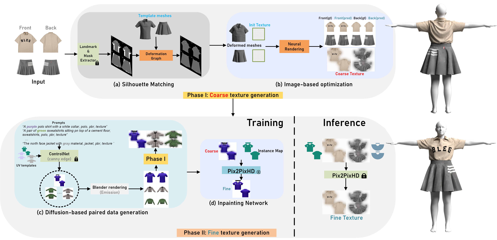
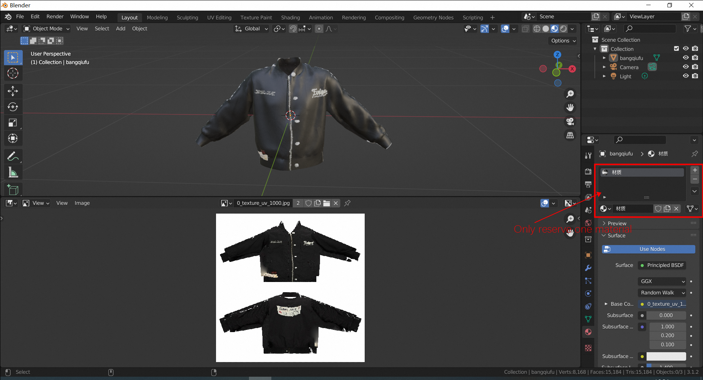
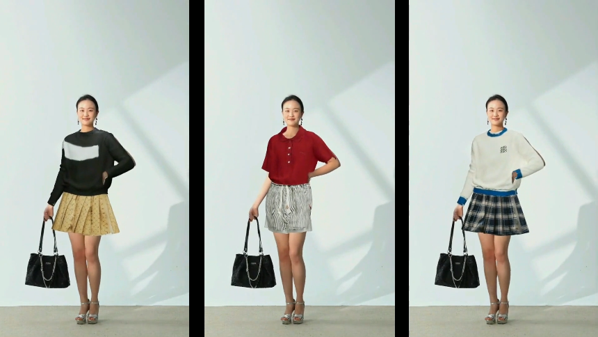
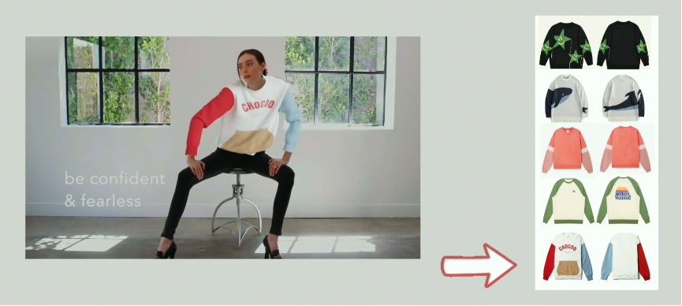

<p align="center">

  <h1 align="center">Cloth2Tex: Cloth2Tex: A Customized Cloth Texture Generation Pipeline for 3D Virtual Try-On</h1>
  <h2 align="center">3DV 2024</h2>
  <div align="center">
    
  </div>
  
  <div class="is-size-5 publication-authors">
    <span class="author-block">
        <a href="">Daiheng Gao</a><sup>1</sup>,</span>
    <span class="author-block">
        <a href="">Xu Chen</a><sup>2,3</sup>,</span>
    <span class="author-block">
        <a href="">Xindi Zhang</a><sup>1</sup>,
    </span>
    <span class="author-block">
        <a href="">Qi Wang</a><sup>1</sup>,
    </span>
    <span class="author-block">
        <a href="">Ke Sun</a><sup>1</sup>,
    </span>
    <span class="author-block">
        <a href="">Bang Zhang</a><sup>1</sup>,
    </span>
    <span class="author-block">
        <a href="">Liefeng Bo</a><sup>1</sup>,
    </span>
    <span class="author-block">
        <a href="">Qixing Huang</a><sup>4</sup>,
    </span>
    </div>
    <div class="is-size-5 publication-authors">
    <span class="author-block"><sup>1</sup>Alibaba XR Lab,</span>
    <span class="author-block"><sup>2</sup>ETH Zurich, Department of Computer Science,</span>
    <span class="author-block"><sup>3</sup>Max Planck Institute for Intelligent Systems,</span>
    <span class="author-block"><sup>4</sup>The University of Texas at Austin</span>
    </div>
    </div>


  <p align="center">
  <br>
<br></br>
    <a href='https://arxiv.org/abs/2308.04288'>
      
    </a>
    <a href='https://tomguluson92.github.io/projects/cloth2tex/' style='padding-left: 0.5rem;'>
      
    <a href="https://www.youtube.com/watch?v=RFMNKe6supE"></a>
  </p>
</p>
  </p>
</p>

<br />

---
## 1. Installation

Our enviroment is *python3.8, pytorch1.13, cuda11.7*, you can change the following instructions that suitable for your settings.

```shell
    sudo apt-get update -y
    sudo apt-get install libgl1
    sudo apt-get install libboost-dev
```

- **pytorch3d** [code](https://pytorch3d.org/)
- **psbody-mesh** [code](https://github.com/MPI-IS/mesh)
- **Kaolin** [code](https://github.com/NVIDIAGameWorks/kaolin)
- **torch_geometric** [code](https://data.pyg.org/whl/)

```
pip install torch_geometric
pip install pyg_lib-0.3.0+pt113cu117-cp38-cp38-linux_x86_64.whl
pip install torch_cluster-1.6.1+pt113cu117-cp38-cp38-linux_x86_64.whl
pip install torch_scatter-2.1.1+pt113cu117-cp38-cp38-linux_x86_64.whl
pip install torch_sparse-0.6.15+pt113cu117-cp38-cp38-linux_x86_64.whl
```

---

## 2. Architecture

Cloth2Tex is composed of two phase: (1) **Coarse texture generation** and (2) **Fine texture completion**. Where Phase I is to determine the 3D garment shape and coarse texture. We do this by registering our parametric garment meshes onto catalog images using a neural mesh renderer. The pipeline’s Then Phase II is to recover fine textures from the coarse estimate of Phase I. We use image translation networks trained on large-scale data synthesized by pre-trained latent diffusion models.

We only made **Phase I** publicly available for now.



---

## 3. Inference

### Phase I (w/o automatic scaling mechanism)

``` shell
python phase1_inference.py --g 1_wy --s 1.2 --d "20231017_wy" --steps_one 501 --steps_two 1001
```

The optimized results are saved in `experiments/20231017_wy`, `x_texture_uv_1000.jpg` is the final UV texture.

Users can check it with **Blender**, remember you should only reserve one material, and remove other redundant materials for textured mesh.




#### (a) reference scale coefficient

The noteworthy thing here is that we are not make automatic scaling mechanism code publicly available, if you need it, you could self-implement it or manually adjust the `--s` (scale).

Default coefficient for test images:
``` python
per_scale_dict = {"1_wy": 1.1,
                  "2_Polo": 0.8, # default 0.8
                  "3_Tshirt": 0.9, # default 0.7
                  "4_shorts": 0.75, # # default 0.7
                  "5_trousers": 0.75,
                  "6_zipup": 1.1,
                  "7_windcoat": 0.65,
                  "9_jacket": 1.0,
                  "11_skirt": 1.0} 
```

#### (b) The landmark detector

We are not going to release the 2D landmark detector. If you need an accurate 2D landmarks in accordance with **Cloth2Tex**, you can annotate it manually or train a simple 2D cloth landmark detector with the same definition from **Cloth2Tex**.

### Phase II (Inpainting/Completion Network)

We are applying for the open-source of Phase II, we will update once approval procedure has finished.

---

## 4. Demo

### Real world 3D Try-On



Please check cloth2tex web page for animated visual results: [cloth2tex](https://tomguluson92.github.io/projects/cloth2tex/) or check our youtube video [youtube](https://www.youtube.com/watch?v=RFMNKe6supE).

---

## 5. Citation

```bibtex
@article{gao2023cloth2tex,
  title={Cloth2Tex: A Customized Cloth Texture Generation Pipeline for 3D Virtual Try-On},
  author={Gao, Daiheng and Chen, Xu and Zhang, Xindi and Wang, Qi and Sun, Ke and Zhang, Bang and Bo, Liefeng and Huang, Qixing},
  journal={arXiv preprint arXiv:2308.04288},
  year={2023}
}
```